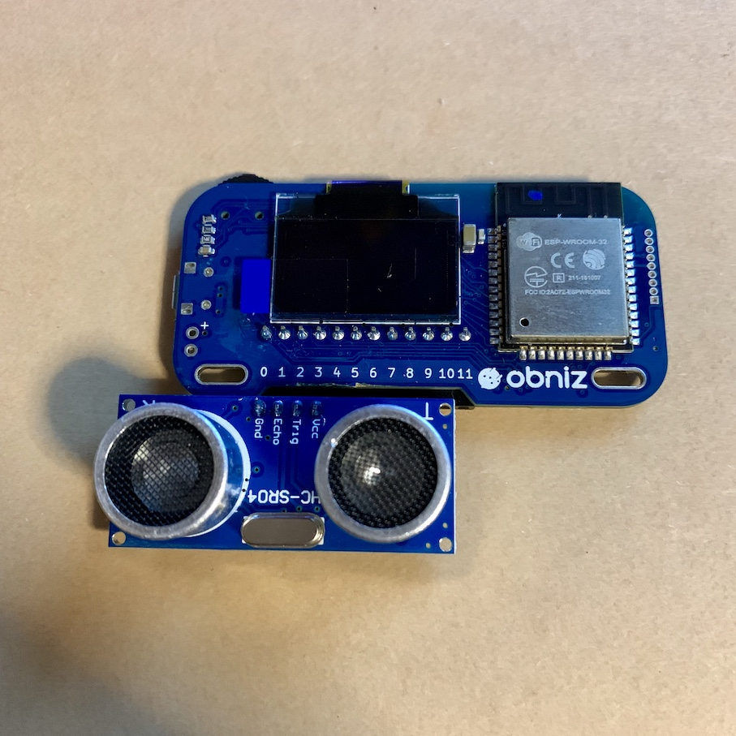

# obniz-desk-open-check
Obnizと超音波距離センサーで机が開いたらIFTTTのWEBHOOKを叩く

## 構成

* Obniz
* HC-SR04



## 設定

.envに下記変数を設定

```
OBNIZ_ID=手持ちのObnizのID(XXXX-XXXX)
IFTTT_WEBHOOK_KEY=IFTTT、WEBHOOKのキー
```

IFTTTのWEBHOOKで発行されるイベント名は`open_desk`

## 実行方法

机の引き出しにデバイスを仕込んで

`npm start`

